# OpenWebUI-LangFlow Integration Platform

[](https://github.com/pre-commit/pre-commit)
[](https://www.docker.com/)
[](https://kubernetes.io/)
[](https://www.python.org/)
[](https://openwebui.com/)
[](https://langflow.org/)
[](https://taskfile.dev/)
[](https://helm.sh/)

A production-ready framework connecting OpenWebUI's chat interface with LangFlow's AI workflow engine via Python pipelines. Build sophisticated conversational AI applications with visual workflow management on Kubernetes.

## 📋 Table of Contents

- [Quick Start](#quick-start)
- [Architecture](#architecture)
- [Components](#components)
- [Available Pipelines](#available-pipelines)
- [Installation](#installation)
- [Pipeline Development](#pipeline-development)
- [Daily Workflow](#daily-workflow)
- [Deployment Options](#deployment-options)
- [Configuration](#configuration)
- [Troubleshooting](#troubleshooting)
- [Contributing](#contributing)

## Quick Start

```bash
git clone https://github.com/pawelrosada/langflow-ui.git
cd langflow-ui

# Complete setup (creates cluster, deploys apps, loads pipelines)
task quickstart

# Access applications:
# OpenWebUI: http://localhost:3000
# Langflow: http://localhost:7860
# Pipelines API: http://localhost:9099
```

## Architecture

> 📋 **For comprehensive technical documentation, component specifications, and advanced architecture patterns, see [ARCHITECTURE.md](./ARCHITECTURE.md)**

### System Overview

```mermaid
graph TB
    User([👤 User]) --> OpenWebUI["🌐 OpenWebUI<br/>Chat Interface<br/>Port 3000"]

    OpenWebUI --> |"OpenAI API<br/>HTTP REST"| Pipelines["🔧 Pipelines<br/>Integration Layer<br/>Port 9099"]

    Pipelines --> |"HTTP API<br/>JSON"| LangFlow["⚡ LangFlow<br/>Workflow Engine<br/>Port 7860"]

    LangFlow --> |SQL| PostgreSQL[("🗄️ PostgreSQL<br/>Database<br/>Port 5432")]

    LangFlow --> |"API Calls"| AIModels["🤖 AI Models<br/>GPT-4, Gemini, Claude"]

    AIModels --> LangFlow
    LangFlow --> Pipelines
    Pipelines --> OpenWebUI
    OpenWebUI --> User

    subgraph DockerNet ["Docker Network"]
        OpenWebUI
        Pipelines
        LangFlow
        PostgreSQL
    end

    classDef frontend fill:#e1f5fe
    classDef integration fill:#f3e5f5
    classDef workflow fill:#e8f5e8
    classDef database fill:#fff3e0
    classDef external fill:#fce4ec

    class OpenWebUI frontend
    class Pipelines integration
    class LangFlow workflow
    class PostgreSQL database
    class AIModels external
```



### Data Flow Architecture

```mermaid
sequenceDiagram
    participant U as 👤 User
    participant OW as 🌐 OpenWebUI
    participant P as 🔧 Pipelines
    participant LF as ⚡ LangFlow
    participant DB as 🗄️ PostgreSQL
    participant AI as 🤖 AI Models

    U->>OW: Send Message
    OW->>P: "POST /v1/chat/completions"
    P->>P: "Rate Limiting & Validation"
    P->>LF: "POST /api/v1/run/{workflow_id}"
    LF->>DB: Load Workflow Config
    DB-->>LF: Workflow Definition
    LF->>AI: "API Request (GPT/Gemini/Claude)"
    AI-->>LF: AI Response
    LF->>DB: Store Conversation
    LF-->>P: JSON Response
    P->>P: "Format & Process"
    P-->>OW: Streaming Response
    OW-->>U: Display Response
```



## Components

- **OpenWebUI**: Modern chat interface with user management
- **LangFlow**: Visual AI workflow builder with 200+ components
- **Pipelines**: 25+ Python integrations connecting chat to workflows
- **PostgreSQL**: Persistent data storage for workflows and conversations

## Available Pipelines

**🔧 Pipeline Generator** - Auto-creates pipelines from LangFlow workflows
**📝 Content**: Blog Writer, Instagram Copywriter, Twitter Thread Generator
**🔍 Research**: Market Research, Financial Analysis, News Aggregation
**🤖 AI Models**: OpenAI, Claude, Gemini integrations
**📊 RAG**: Vector Store, Hybrid Search, Document Processing
**🎯 Agents**: Search, Social Media, Customer Support

## Installation

### Prerequisites
- Docker (8GB+ RAM recommended)
- Internet connection for AI model APIs

### Option 1: Docker Compose (Quick)
```bash
./setup-openwebui.sh
```

### Option 2: Kubernetes Development (Full Platform)
```bash
task setup      # Install tools, create cluster
task start      # Start environment
task deploy     # Deploy applications
task status     # Check everything
```

## Pipeline Development

### Update Pipelines
```bash
# Modify files in pipelines/ directory
task update-pipelines    # Deploy to cluster
task pipelines-status    # Verify loaded
```

### Create Custom Pipeline
```python
# pipelines/my_pipeline.py
class Pipeline:
    def __init__(self):
        self.name = "My Custom Pipeline"
        self.id = "my_custom"

    def pipe(self, user_message, model_id, messages, body):
        # Your logic here
        return f"Processed: {user_message}"
```

### Pipeline Generator Usage
1. Access "🔧 Pipeline Generator" in OpenWebUI
2. Automatically discovers LangFlow workflows
3. Generates Python pipeline files
4. Persists across restarts

### Pipeline Architecture

```mermaid
graph TB
    OpenWebUI["🌐 OpenWebUI"] --> |"HTTP Request"| Pipelines["🔧 Pipelines Service"]

    subgraph Pipelines ["🔧 Pipelines Container"]
        Generator["🔧 Pipeline Generator"]
        Pipeline1["📝 Blog Writer"]
        Pipeline2["🔍 Research Agent"]
        PipelineN["... 25+ Pipelines"]
    end

    Pipelines --> |"Workflow Execution"| Langflow["⚡ Langflow"]

    subgraph Storage ["💾 Persistent Storage"]
        PVC["PersistentVolumeClaim"]
        ConfigMap["Pipeline Files ConfigMap"]
    end

    ConfigMap --> |"Init Container"| Pipelines
    Pipelines --> |"Generated Files"| PVC
```



## Daily Workflow

```bash
task up          # Start everything
task status      # Check services
task logs        # View application logs
task update-pipelines  # Update pipeline code
task stop        # Stop environment
```

## Deployment Options

**Development**: Kubernetes with Kind cluster (auto-managed)
**Production**: See [HELM_DEVELOPMENT.md](./HELM_DEVELOPMENT.md) for scaling, security, monitoring

## Configuration

**Database**: PostgreSQL for all services
**Persistence**: Automatic with PersistentVolumes
**Secrets**: Kubernetes secrets (dev) or external vault (prod)
**Scaling**: Horizontal pod autoscaling available

## Troubleshooting

```bash
# Check pipeline status
task pipelines-status

# View logs
task pipelines-logs

# Restart pipelines
kubectl rollout restart deployment/langflow-app-pipelines

# Test pipeline API
curl -H "Authorization: Bearer API_KEY" http://localhost:9099/v1/models
```

## Contributing

1. Fork the repository
2. Modify pipelines or add new ones
3. Test with `task update-pipelines`
4. Submit focused pull requests

**Key Files**:
- `pipelines/` - Pipeline implementations
- `helm/` - Kubernetes deployment
- `scripts/` - Automation tools
- `Taskfile.yml` - Development commands
