# OpenWebUI-LangFlow-MCP Integration Framework

## Table of Contents
- [Overview](#overview)
- [Architecture](#architecture)
- [Components](#components)
- [Ready-to-Use Blocks](#ready-to-use-blocks)
- [Installation](#installation)
- [Usage](#usage)
- [Deployment Options](#deployment-options)
- [Configuration](#configuration)
- [Contributing](#contributing)

## Overview

A comprehensive integration framework that connects OpenWebUI's intuitive chat interface with LangFlow's powerful AI workflow engine through custom Python pipelines. This repository provides a complete, production-ready solution for building and deploying conversational AI applications with visual workflow management.

The framework bridges the gap between user-friendly chat interfaces and complex AI workflows, enabling developers to create sophisticated AI applications without sacrificing usability or flexibility. Whether you're building customer support bots, content generation tools, or interactive AI assistants, this integration provides all the necessary components in a containerized, scalable architecture.

## Architecture

### System Overview

```mermaid
graph TB
    User([👤 User]) --> OpenWebUI[🌐 OpenWebUI<br/>Chat Interface<br/>:3000]
    
    OpenWebUI --> |OpenAI API<br/>HTTP REST| Pipelines[🔧 Pipelines<br/>Integration Layer<br/>:9099]
    
    Pipelines --> |HTTP API<br/>JSON| LangFlow[⚡ LangFlow<br/>Workflow Engine<br/>:7860]
    
    LangFlow --> |SQL| PostgreSQL[(🗄️ PostgreSQL<br/>Database<br/>:5432)]
    
    LangFlow --> |API Calls| AIModels[🤖 AI Models<br/>GPT-4, Gemini, Claude]
    
    AIModels --> LangFlow
    LangFlow --> Pipelines
    Pipelines --> OpenWebUI
    OpenWebUI --> User
    
    subgraph "Docker Network"
        OpenWebUI
        Pipelines
        LangFlow
        PostgreSQL
    end
    
    classDef frontend fill:#e1f5fe
    classDef integration fill:#f3e5f5
    classDef workflow fill:#e8f5e8
    classDef database fill:#fff3e0
    classDef external fill:#fce4ec
    
    class OpenWebUI frontend
    class Pipelines integration
    class LangFlow workflow
    class PostgreSQL database
    class AIModels external
```



### Data Flow Architecture

```mermaid
sequenceDiagram
    participant U as 👤 User
    participant OW as 🌐 OpenWebUI
    participant P as 🔧 Pipelines
    participant LF as ⚡ LangFlow
    participant DB as 🗄️ PostgreSQL
    participant AI as 🤖 AI Models

    U->>OW: Send Message
    OW->>P: POST /v1/chat/completions
    P->>P: Rate Limiting & Validation
    P->>LF: POST /api/v1/run/{workflow_id}
    LF->>DB: Load Workflow Config
    DB-->>LF: Workflow Definition
    LF->>AI: API Request (GPT/Gemini/Claude)
    AI-->>LF: AI Response
    LF->>DB: Store Conversation
    LF-->>P: JSON Response
    P->>P: Format & Process
    P-->>OW: Streaming Response
    OW-->>U: Display Response
```



The architecture follows a clean separation of concerns:
- **Frontend Layer**: OpenWebUI provides the chat interface and user management
- **Integration Layer**: Custom Python pipelines handle routing and data transformation  
- **Workflow Layer**: LangFlow manages AI workflows with visual flow builder
- **Data Layer**: PostgreSQL stores workflow configurations and chat history

> 📋 For detailed technical documentation, component specifications, and advanced architecture patterns, see [ARCHITECTURE.md](./ARCHITECTURE.md)

## Components

### 🖥️ **OpenWebUI**
Modern chat interface with support for:
- Multiple user management and authentication
- Real-time conversations with streaming responses
- File upload and document processing
- Custom model configurations
- Plugin system for extended functionality
- Responsive design for desktop and mobile

**Configuration**: Runs on port 3000, connects to pipelines via internal Docker network.

### 🔧 **Pipelines**
Custom Python integration layer featuring:
- **Rate Limiting**: Prevents API overload with configurable limits
- **Error Handling**: Comprehensive error management with user-friendly messages
- **Model Routing**: Dynamic routing between different AI models
- **Response Formatting**: Structured output processing for optimal UX
- **Logging System**: Detailed debugging and monitoring capabilities

**API Endpoint**: http://localhost:9099 - Compatible with OpenAI API format

### ⚡ **LangFlow**
Visual AI workflow builder with:
- **Drag-and-Drop Interface**: Build complex AI workflows visually
- **Component Library**: Pre-built nodes for common AI operations
- **Custom Components**: Create reusable workflow components
- **Version Control**: Track and manage workflow versions
- **Real-time Testing**: Test workflows directly in the interface

**Access**: http://localhost:7860 - Full workflow management interface

### 🗄️ **PostgreSQL Database**
Persistent storage for:
- LangFlow workflow configurations
- Chat conversation history
- User session data
- Component metadata and settings

## Ready-to-Use Blocks

### 🔄 **LangFlow Workflows**

#### **GPT-4o Chat Workflow** ([gpt-4o-workflow.json](./examples/gpt-4o-workflow.json))
- OpenAI GPT-4o integration with optimized prompting
- Supports conversation context and memory
- Configured for general-purpose chat interactions
- Rate limiting and error handling built-in

#### **Gemini 2.5 Flash Workflow** ([gemini-2.5-flash-workflow.json](./examples/gemini-2.5-flash-workflow.json))
- Google Gemini integration for fast responses
- Optimized for quick queries and real-time interactions
- Multimodal capabilities for text and image processing
- Cost-effective for high-volume applications

#### **Claude Sonnet 4 Workflow** ([claude-sonnet-4-workflow.json](./examples/claude-sonnet-4-workflow.json))
- Anthropic Claude integration with safety features
- Excellent for complex reasoning and analysis tasks
- Built-in content moderation and safety filters
- Optimized prompt engineering for consistent outputs

### 🐍 **Integration Pipelines**

#### **Basic Pipeline** ([langflow_pipeline.py](./pipelines/langflow_pipeline.py))
- Simple OpenWebUI ↔ LangFlow bridge
- Single workflow routing
- Basic error handling and logging
- Perfect starting point for custom implementations

#### **Enhanced Pipeline** ([enhanced_langflow_pipeline.py](./pipelines/enhanced_langflow_pipeline.py))
- Multi-model support with dynamic routing
- Advanced user commands (`@model:gemini`, `@model:gpt`, `@model:claude`)
- Intelligent agent routing based on query analysis
- Backward compatibility with existing setups

#### **Workflow Selector** ([workflow_selector_pipeline.py](./pipelines/workflow_selector_pipeline.py))
- Dynamic workflow selection based on user input
- Support for multiple concurrent workflows
- Context-aware routing and load balancing
- Advanced session management

## Installation

### Prerequisites
- Docker and Docker Compose
- 4GB+ RAM recommended
- Internet connection for model API access

### Quick Start
```bash
# Clone the repository
git clone https://github.com/pawelrosada/langflow-ui.git
cd langflow-ui

# Start all services
./setup-openwebui.sh

# Access the applications
# OpenWebUI: http://localhost:3000
# LangFlow: http://localhost:7860
```

### Clean Installation
```bash
# Start with fresh data (removes all volumes)
./setup-openwebui.sh --clean
```

## Usage

1. **Import Workflows**: Load example workflows into LangFlow via the web interface
2. **Configure Pipelines**: Modify pipeline configurations in the `pipelines/` directory
3. **Test Integration**: Send messages through OpenWebUI to test the complete pipeline
4. **Monitor Logs**: Use `docker-compose logs -f` to monitor all services

## Deployment Options

### Docker Compose (Development)
Default setup using `docker-compose.yml` with all services on single machine.

### Kubernetes with Helm (Production)
See [HELM_DEVELOPMENT.md](./HELM_DEVELOPMENT.md) for comprehensive production deployment including:
- Horizontal scaling configuration
- Production PostgreSQL with high availability
- Security hardening and secrets management
- Load balancing and ingress setup
- Monitoring and observability stack

## Configuration

### Environment Variables
- `LANGFLOW_DATABASE_URL`: PostgreSQL connection string
- `OPENAI_API_KEY`: API keys for model access
- `PIPELINES_API_KEY`: Pipeline authentication token

### Model API Keys
Configure your AI model API keys in the pipeline files or via environment variables for production deployments.

## Contributing

We welcome contributions! Please:
1. Fork the repository
2. Create feature branches for changes
3. Ensure all services start correctly with `./setup-openwebui.sh`
4. Submit focused pull requests with clear descriptions
5. Include tests for new pipeline features

Keep changes minimal and well-documented. Test thoroughly in both development and production environments.